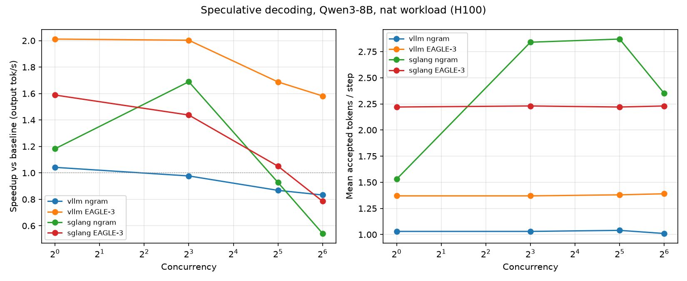
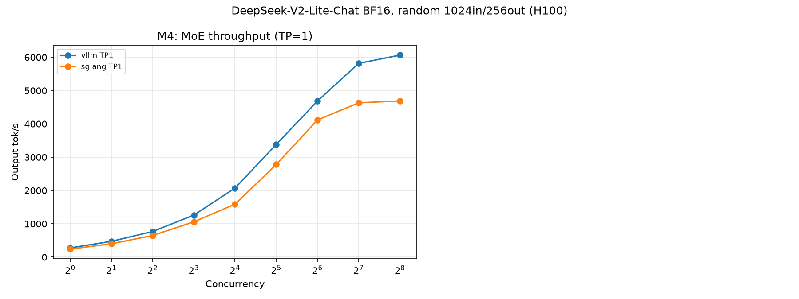

# llm-inference-bench

End-to-end benchmark of LLM inference engines (vLLM / SGLang / TensorRT-LLM) on
NVIDIA H100: throughput and latency under continuous batching and
PagedAttention, FP8 weight and KV-cache quantization with accuracy regression
(GSM8K / MMLU), speculative decoding (n-gram / EAGLE-3) acceptance analysis,
tensor-parallel (TP=2) scaling, and kernel-level attribution with Nsight
Systems. Fairness rules and the full matrix are defined in
[docs/decisions/p3s-001-scope.md](docs/decisions/p3s-001-scope.md).

## Status

### DONE (G0, 2026-08-28)

- Pod provisioning script ([scripts/setup_pod.sh](scripts/setup_pod.sh)):
  uv-managed venvs for vLLM, SGLang, and the bench client.
- Models downloaded: Qwen/Qwen3-8B and deepseek-ai/DeepSeek-V2-Lite-Chat.
- Closed-loop streaming benchmark client ([bench/client.py](bench/client.py)).
- First smoke benchmark: vLLM + Qwen3-8B, one cell (results below).
- SGLang sanity check: server launched, one completion returned HTTP 200.

### DONE (W1, 2026-08-28) — two-engine dense matrix (vLLM 0.28.0 / SGLang 0.5.9, Qwen3-8B, H100)

- Concurrency sweep driver ([bench/sweep.py](bench/sweep.py)) with per-cell
  manifests and speculative-decoding acceptance capture; "nat" workload
  (GSM8K question texts via the `datasets` library).
- M1: BF16 throughput/latency curves, both engines, concurrency 1–256.
- M2: FP8 sweeps (vLLM fp8 weights / fp8 KV / both; SGLang fp8 online quant)
  plus lm-eval accuracy regression (GSM8K 5-shot n=500, MMLU 20/subtask)
  for vLLM BF16 / fp8-weights / fp8-weights+KV via the live server API.
- M3: speculative decoding (vLLM ngram + EAGLE-3, SGLang NGRAM + EAGLE3)
  with acceptance analysis and greedy-consistency spot checks.
- Decisions and caveats: [docs/env/w1_notes.md](docs/env/w1_notes.md).

### DONE (W1 TRT-LLM arm, 2026-08-28) — third engine on the M1 matrix (TensorRT-LLM 1.2.1, Qwen3-8B, H100)

- Separate pod: NVIDIA NGC TensorRT-LLM release container (system install,
  versions in [docs/env/w1_trtllm_versions.txt](docs/env/w1_trtllm_versions.txt)).
- `trtllm-serve` OpenAI-compatible endpoint, PyTorch backend, engine defaults,
  no offline engine build ([scripts/serve_trtllm.sh](scripts/serve_trtllm.sh)).
- M1: BF16 throughput/latency curves, concurrency 1–256, same workload and
  fairness rules as vLLM/SGLang (random 1024in/256out, greedy, ignore_eos);
  cells `w1_m1_trtllm_c*` in the M1 table and fig1/fig2 below.

### PLANNED

- MoE model (DeepSeek-V2-Lite-Chat) matrix; TP=2 scaling (M5); Nsight
  attribution (M6) — see the scope doc.
- TensorRT-LLM on the remaining W1 milestones (FP8, speculative decoding).
- Nsight Systems profiling (nsys) runs.

## Environment

<!-- GEN:env -->
| GPU | Driver | Engine | Version | Cells |
|---|---|---|---|---|
| NVIDIA H100 80GB HBM3 | 580.126.09 | sglang | 0.5.9 | 40 |
| NVIDIA H100 80GB HBM3 | 580.126.09 | trtllm | 1.2.1 | 9 |
| NVIDIA H100 80GB HBM3 | 580.126.09 | vllm | 0.28.0 | 59 |

Source: `results/manifests/*.json` (per-cell launch commands there), rendered by `analysis/report/make_report.py`.
<!-- /GEN:env -->

## G0 smoke benchmark

Single cell, engine defaults, config in
[configs/g0_smoke.yaml](configs/g0_smoke.yaml). Not a tuned or comparative
result — a pipeline check only.

<!-- GEN:g0_smoke -->
Engine: **vllm**, model: **Qwen/Qwen3-8B**, random workload 1024 in / 256 out, greedy, ignore_eos.

| Concurrency | N | TTFT p50 (ms) | TTFT p95 (ms) | TPOT p50 (ms) | TPOT p95 (ms) | Output tok/s |
|---|---|---|---|---|---|---|
| 8 | 32 | 245.4 | 271.7 | 7.1 | 7.6 | 991.6 |

Source: `results/raw/g0_smoke_vllm_qwen3-8b.summary.json` (per-request data: `results/raw/g0_smoke_vllm_qwen3-8b.jsonl`), rendered by `analysis/report/make_report.py`.
<!-- /GEN:g0_smoke -->

## W1 M1 — BF16 throughput/latency curves (vLLM vs SGLang)

Full concurrency sweep (1–256), engine defaults, Qwen/Qwen3-8B, random
workload 1024 in / 256 out, greedy, ignore_eos. Driven by
[bench/sweep.py](bench/sweep.py).

<!-- GEN:w1_m1 -->
**vllm** (defaults):

| Concurrency | N | TTFT p50 (ms) | TTFT p95 (ms) | TPOT p50 (ms) | TPOT p95 (ms) | Output tok/s |
|---|---|---|---|---|---|---|
| 1 | 64 | 70.0 | 89.5 | 6.77 | 7.00 | 141.7 |
| 2 | 64 | 68.3 | 74.8 | 6.82 | 6.83 | 282.8 |
| 4 | 64 | 78.4 | 86.3 | 6.98 | 7.01 | 551.9 |
| 8 | 64 | 101.3 | 127.8 | 7.07 | 7.14 | 1070.7 |
| 16 | 64 | 127.9 | 181.6 | 7.64 | 7.74 | 1949.1 |
| 32 | 64 | 187.2 | 282.4 | 8.66 | 8.91 | 3308.3 |
| 64 | 128 | 398.0 | 564.6 | 13.05 | 15.82 | 4274.0 |
| 128 | 256 | 500.2 | 5801.0 | 18.19 | 20.71 | 4924.6 |
| 256 | 512 | 848.8 | 20945.7 | 20.00 | 22.19 | 4512.0 |

**sglang** (defaults):

| Concurrency | N | TTFT p50 (ms) | TTFT p95 (ms) | TPOT p50 (ms) | TPOT p95 (ms) | Output tok/s |
|---|---|---|---|---|---|---|
| 1 | 64 | 44.6 | 53.5 | 7.01 | 7.03 | 139.7 |
| 2 | 64 | 38.2 | 47.7 | 7.19 | 7.22 | 273.2 |
| 4 | 64 | 56.1 | 72.0 | 7.37 | 7.42 | 529.0 |
| 8 | 64 | 69.1 | 85.3 | 7.71 | 7.79 | 1003.9 |
| 16 | 64 | 96.8 | 130.1 | 8.34 | 8.49 | 1828.9 |
| 32 | 64 | 184.4 | 247.7 | 9.41 | 9.66 | 3131.3 |
| 64 | 128 | 410.4 | 1426.6 | 12.06 | 16.60 | 4087.5 |
| 128 | 256 | 622.3 | 6454.1 | 15.26 | 20.36 | 4571.6 |
| 256 | 512 | 4797.4 | 19015.8 | 17.90 | 22.96 | 4218.4 |

**trtllm** (defaults):

| Concurrency | N | TTFT p50 (ms) | TTFT p95 (ms) | TPOT p50 (ms) | TPOT p95 (ms) | Output tok/s |
|---|---|---|---|---|---|---|
| 1 | 64 | 59.0 | 63.8 | 6.96 | 6.99 | 139.3 |
| 2 | 64 | 61.6 | 71.5 | 7.33 | 7.35 | 264.6 |
| 4 | 64 | 66.5 | 75.3 | 7.59 | 7.61 | 511.1 |
| 8 | 64 | 80.1 | 112.8 | 7.80 | 7.83 | 987.5 |
| 16 | 64 | 106.0 | 236.0 | 8.35 | 8.43 | 1802.1 |
| 32 | 64 | 260.0 | 356.6 | 9.33 | 9.50 | 3074.8 |
| 64 | 128 | 594.6 | 923.8 | 12.72 | 16.56 | 4052.3 |
| 128 | 256 | 800.7 | 12877.2 | 22.19 | 25.82 | 3570.3 |
| 256 | 512 | 894.9 | 28339.7 | 25.51 | 27.61 | 3525.7 |


Source: `results/raw/w1_m1_*_c*.summary.json`, rendered by `analysis/report/make_report.py`.
<!-- /GEN:w1_m1 -->

## W1 M2 — FP8 variants + accuracy regression

FP8 weight and KV-cache quantization sweeps, plus lm-eval accuracy against the
live server (exact commands in `results/accuracy/`).

<!-- GEN:w1_m2 -->
Output tok/s by concurrency:

| Concurrency | vLLM BF16 (M1) | vLLM FP8 weights | vLLM FP8 KV cache | vLLM FP8 weights+KV | SGLang FP8 weights |
|---|---|---|---|---|---|
| 1 | 141.7 | 210.1 | 141.0 | 205.1 | 195.8 |
| 2 | 282.8 | 416.4 | 280.4 | 406.5 | 374.5 |
| 4 | 551.9 | 798.2 | 548.3 | 791.2 | 712.8 |
| 8 | 1070.7 | 1479.6 | 1059.6 | 1505.2 | 1309.4 |
| 16 | 1949.1 | 2611.2 | 1982.4 | 2744.0 | 2350.5 |
| 32 | 3308.3 | 4201.5 | 3465.0 | 4401.3 | 3879.8 |
| 64 | 4274.0 | 5340.8 | 4620.0 | 5931.4 | 4985.3 |
| 128 | 4924.6 | 5932.8 | 5352.0 | 6687.1 | 5446.0 |
| 256 | 4512.0 | 5566.5 | 5503.3 | 6828.2 | 5114.8 |


Accuracy (lm-eval via the live server API; GSM8K 5-shot limit 500, MMLU limit 20/subtask):

| Config | GSM8K (strict) | Δ vs BF16 | MMLU | Δ vs BF16 |
|---|---|---|---|---|
| vLLM BF16 | 0.9080 | baseline | 0.7596 | baseline |
| vLLM FP8 weights | 0.9020 | -0.0060 | 0.7649 | +0.0053 |
| vLLM FP8 weights+KV | 0.8760 | -0.0320 | 0.7518 | -0.0079 |

Source: `results/raw/w1_m2_*_c*.summary.json`, `results/accuracy/*.json`, rendered by `analysis/report/make_report.py`.
<!-- /GEN:w1_m2 -->

## W1 M3 — Speculative decoding

n-gram and EAGLE-3 speculative decoding vs baseline, nat workload (GSM8K
question texts), greedy, 256 out, ignore_eos, concurrency {1, 8, 32, 64}.
Acceptance is reported only where the engine exposes counters or log lines.

<!-- GEN:w1_m3 -->
**vllm** (nat workload = GSM8K questions, greedy, 256 out, ignore_eos):

| Concurrency | baseline tok/s | ngram tok/s | speedup | accepted/step | EAGLE-3 tok/s | speedup | accepted/step |
|---|---|---|---|---|---|---|---|
| 1 | 147.1 | 153.3 | 1.04x | 1.03 | 296.0 | 2.01x | 1.37 |
| 8 | 1129.9 | 1103.8 | 0.98x | 1.03 | 2263.4 | 2.00x | 1.37 |
| 32 | 4164.3 | 3613.3 | 0.87x | 1.04 | 7027.6 | 1.69x | 1.38 |
| 64 | 7393.3 | 6156.3 | 0.83x | 1.01 | 11692.6 | 1.58x | 1.39 |

**sglang** (nat workload = GSM8K questions, greedy, 256 out, ignore_eos):

| Concurrency | baseline tok/s | ngram tok/s | speedup | accepted/step | EAGLE-3 tok/s | speedup | accepted/step |
|---|---|---|---|---|---|---|---|
| 1 | 142.7 | 168.8 | 1.18x | 1.53 | 226.8 | 1.59x | 2.22 |
| 8 | 1083.5 | 1830.3 | 1.69x | 2.84 | 1557.5 | 1.44x | 2.23 |
| 32 | 3977.6 | 3686.7 | 0.93x | 2.87 | 4177.5 | 1.05x | 2.22 |
| 64 | 7202.6 | 3900.5 | 0.54x | 2.35 | 5655.6 | 0.79x | 2.23 |



Source: `results/raw/w1_m3_*_c*.summary.json` and `results/raw/w1_m3_*_c*.accept.json` (acceptance shown only where the engine exposed counters/logs), rendered by `analysis/report/make_report.py`. Acceptance semantics differ per engine and are NOT comparable across rows: vLLM = accepted draft tokens per step from /metrics counter deltas (excludes the target-sampled bonus token); SGLang = mean log-reported accept length (includes the target-sampled token).
<!-- /GEN:w1_m3 -->

## W2 M4 — MoE model (DeepSeek-V2-Lite-Chat), TP=1

BF16, engine defaults plus `--trust-remote-code`, single H100
(`CUDA_VISIBLE_DEVICES=0`), full concurrency sweep (1–256), random workload
1024 in / 256 out, greedy, ignore_eos — same fairness rules as W1 M1.
Includes a single-cell FP8-KV-cache-on-MLA probe (vLLM only).

<!-- GEN:w2_m4 -->
**vllm** (defaults, `--trust-remote-code`):

| Concurrency | N | TTFT p50 (ms) | TTFT p95 (ms) | TPOT p50 (ms) | TPOT p95 (ms) | Output tok/s |
|---|---|---|---|---|---|---|
| 1 | 64 | 80.4 | 94.7 | 3.30 | 3.31 | 276.8 |
| 2 | 64 | 48.7 | 71.2 | 4.04 | 4.11 | 474.4 |
| 4 | 64 | 36.5 | 47.6 | 5.09 | 5.42 | 767.5 |
| 8 | 64 | 39.5 | 72.9 | 6.23 | 6.52 | 1261.8 |
| 16 | 64 | 44.5 | 88.6 | 7.57 | 7.76 | 2071.5 |
| 32 | 64 | 79.1 | 172.9 | 9.03 | 9.11 | 3383.2 |
| 64 | 128 | 166.5 | 436.0 | 12.57 | 14.29 | 4684.4 |
| 128 | 256 | 344.3 | 4475.2 | 15.14 | 16.64 | 5815.5 |
| 256 | 512 | 522.5 | 15573.6 | 14.93 | 16.24 | 6064.4 |

**sglang** (defaults, `--trust-remote-code`):

| Concurrency | N | TTFT p50 (ms) | TTFT p95 (ms) | TPOT p50 (ms) | TPOT p95 (ms) | Output tok/s |
|---|---|---|---|---|---|---|
| 1 | 64 | 55.3 | 68.1 | 3.95 | 3.97 | 240.9 |
| 2 | 64 | 81.2 | 89.0 | 4.70 | 4.81 | 401.8 |
| 4 | 64 | 80.0 | 86.1 | 5.92 | 6.16 | 649.0 |
| 8 | 64 | 111.7 | 121.0 | 7.19 | 7.51 | 1059.2 |
| 16 | 64 | 137.8 | 815.5 | 8.94 | 9.08 | 1589.0 |
| 32 | 64 | 199.3 | 220.3 | 10.71 | 10.89 | 2780.4 |
| 64 | 128 | 364.8 | 1157.0 | 12.95 | 15.61 | 4116.1 |
| 128 | 256 | 547.4 | 6042.8 | 16.76 | 19.42 | 4632.0 |
| 256 | 512 | 5881.4 | 15843.4 | 17.53 | 20.83 | 4687.6 |

FP8 KV cache on MLA (vLLM `--kv-cache-dtype fp8`, single probe cell at C=32): served and completed — TTFT p50 453.3 ms, TPOT p50 9.46 ms, 2826.7 output tok/s (`results/raw/w2_m4_vllm_fp8kv_c032.summary.json`). Probe only; not swept.



Source: `results/raw/w2_m4_*_c*.summary.json`, rendered by `analysis/report/make_report.py`.
<!-- /GEN:w2_m4 -->

## W2 M5 — TP=2 scaling (DeepSeek-V2-Lite-Chat, 2x H100)

Same model, workload, and fairness rules as M4; `--tensor-parallel-size 2`
(vLLM) / `--tp 2` (SGLang); concurrency subset {8, 32, 64, 128, 256}. TP1
reference = the matching M4 cells from the same pod.

<!-- GEN:w2_m5 -->
_No M5 results yet._
<!-- /GEN:w2_m5 -->

## Reproducing

```bash
bash scripts/setup_pod.sh
bash scripts/serve_vllm.sh Qwen/Qwen3-8B
source /workspace/venvs/bench/bin/activate
python bench/client.py --config configs/g0_smoke.yaml
python analysis/report/make_report.py
```
