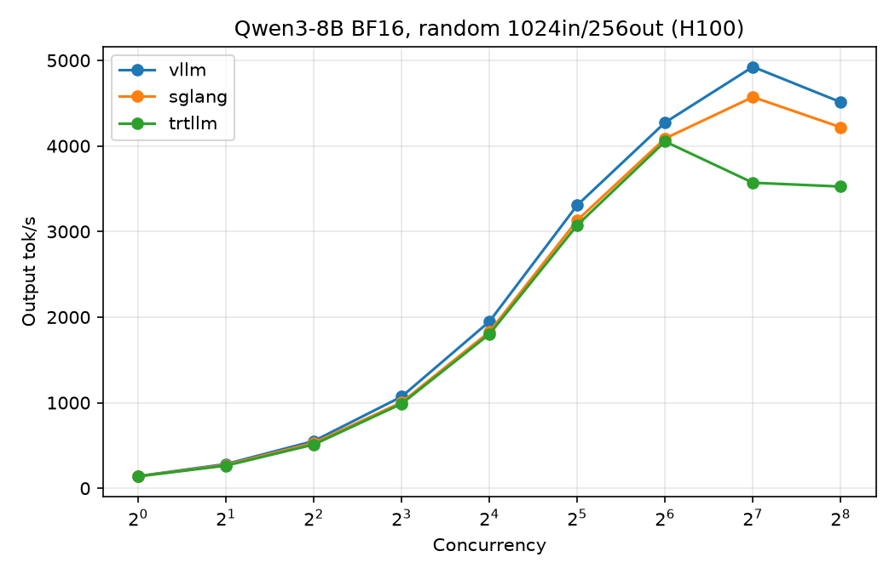
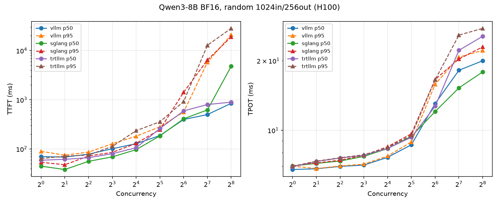
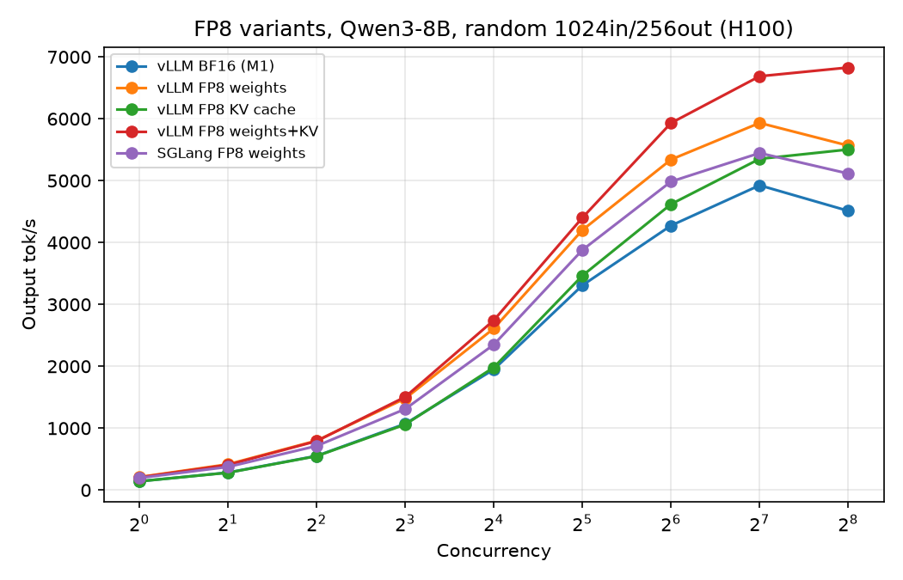

# llm-inference-bench

End-to-end benchmark of LLM inference engines (vLLM / SGLang / TensorRT-LLM) on
NVIDIA H100: throughput and latency under continuous batching and
PagedAttention, FP8 weight and KV-cache quantization with accuracy regression
(GSM8K / MMLU), speculative decoding (n-gram / EAGLE-3) acceptance analysis,
tensor-parallel (TP=2) scaling, and kernel-level attribution with Nsight
Systems. Fairness rules and the full matrix are defined in
[docs/decisions/p3s-001-scope.md](docs/decisions/p3s-001-scope.md).

## Status

### DONE (G0, 2026-08-28)

- Pod provisioning script ([scripts/setup_pod.sh](scripts/setup_pod.sh)):
  uv-managed venvs for vLLM, SGLang, and the bench client.
- Models downloaded: Qwen/Qwen3-8B and deepseek-ai/DeepSeek-V2-Lite-Chat.
- Closed-loop streaming benchmark client ([bench/client.py](bench/client.py)).
- First smoke benchmark: vLLM + Qwen3-8B, one cell (results below).
- SGLang sanity check: server launched, one completion returned HTTP 200.

### PLANNED

- Benchmark matrix M1–M6 (baselines, FP8 weights, FP8 KV cache + accuracy,
  speculative decoding, TP=2 scaling, Nsight attribution) — see the scope doc.
- TensorRT-LLM engine integration.
- Nsight Systems profiling (nsys) runs.

## Environment

<!-- GEN:env -->
| GPU | Driver | Engine | Version | Cells |
|---|---|---|---|---|
| NVIDIA H100 80GB HBM3 | 580.126.09 | sglang | 0.5.9 | 19 |
| NVIDIA H100 80GB HBM3 | 580.126.09 | vllm | 0.28.0 | 37 |

Source: `results/manifests/*.json` (per-cell launch commands there), rendered by `analysis/report/make_report.py`.
<!-- /GEN:env -->

## G0 smoke benchmark

Single cell, engine defaults, config in
[configs/g0_smoke.yaml](configs/g0_smoke.yaml). Not a tuned or comparative
result — a pipeline check only.

<!-- GEN:g0_smoke -->
Engine: **vllm**, model: **Qwen/Qwen3-8B**, random workload 1024 in / 256 out, greedy, ignore_eos.

| Concurrency | N | TTFT p50 (ms) | TTFT p95 (ms) | TPOT p50 (ms) | TPOT p95 (ms) | Output tok/s |
|---|---|---|---|---|---|---|
| 8 | 32 | 245.4 | 271.7 | 7.1 | 7.6 | 991.6 |

Source: `results/raw/g0_smoke_vllm_qwen3-8b.summary.json` (per-request data: `results/raw/g0_smoke_vllm_qwen3-8b.jsonl`), rendered by `analysis/report/make_report.py`.
<!-- /GEN:g0_smoke -->

## W1 M1 — BF16 throughput/latency curves (vLLM vs SGLang)

Full concurrency sweep (1–256), engine defaults, Qwen/Qwen3-8B, random
workload 1024 in / 256 out, greedy, ignore_eos. Driven by
[bench/sweep.py](bench/sweep.py).

<!-- GEN:w1_m1 -->
**vllm** (defaults):

| Concurrency | N | TTFT p50 (ms) | TTFT p95 (ms) | TPOT p50 (ms) | TPOT p95 (ms) | Output tok/s |
|---|---|---|---|---|---|---|
| 1 | 64 | 70.0 | 89.5 | 6.77 | 7.00 | 141.7 |
| 2 | 64 | 68.3 | 74.8 | 6.82 | 6.83 | 282.8 |
| 4 | 64 | 78.4 | 86.3 | 6.98 | 7.01 | 551.9 |
| 8 | 64 | 101.3 | 127.8 | 7.07 | 7.14 | 1070.7 |
| 16 | 64 | 127.9 | 181.6 | 7.64 | 7.74 | 1949.1 |
| 32 | 64 | 187.2 | 282.4 | 8.66 | 8.91 | 3308.3 |
| 64 | 128 | 398.0 | 564.6 | 13.05 | 15.82 | 4274.0 |
| 128 | 256 | 500.2 | 5801.0 | 18.19 | 20.71 | 4924.6 |
| 256 | 512 | 848.8 | 20945.7 | 20.00 | 22.19 | 4512.0 |

**sglang** (defaults):

| Concurrency | N | TTFT p50 (ms) | TTFT p95 (ms) | TPOT p50 (ms) | TPOT p95 (ms) | Output tok/s |
|---|---|---|---|---|---|---|
| 1 | 64 | 44.6 | 53.5 | 7.01 | 7.03 | 139.7 |
| 2 | 64 | 38.2 | 47.7 | 7.19 | 7.22 | 273.2 |
| 4 | 64 | 56.1 | 72.0 | 7.37 | 7.42 | 529.0 |
| 8 | 64 | 69.1 | 85.3 | 7.71 | 7.79 | 1003.9 |
| 16 | 64 | 96.8 | 130.1 | 8.34 | 8.49 | 1828.9 |
| 32 | 64 | 184.4 | 247.7 | 9.41 | 9.66 | 3131.3 |
| 64 | 128 | 410.4 | 1426.6 | 12.06 | 16.60 | 4087.5 |
| 128 | 256 | 622.3 | 6454.1 | 15.26 | 20.36 | 4571.6 |
| 256 | 512 | 4797.4 | 19015.8 | 17.90 | 22.96 | 4218.4 |





Source: `results/raw/w1_m1_*_c*.summary.json`, rendered by `analysis/report/make_report.py`.
<!-- /GEN:w1_m1 -->

## W1 M2 — FP8 variants + accuracy regression

FP8 weight and KV-cache quantization sweeps, plus lm-eval accuracy against the
live server (exact commands in `results/accuracy/`).

<!-- GEN:w1_m2 -->
Output tok/s by concurrency:

| Concurrency | vLLM BF16 (M1) | vLLM FP8 weights | vLLM FP8 KV cache | vLLM FP8 weights+KV | SGLang FP8 weights |
|---|---|---|---|---|---|
| 1 | 141.7 | 210.1 | 141.0 | 205.1 | 195.8 |
| 2 | 282.8 | 416.4 | 280.4 | 406.5 | 374.5 |
| 4 | 551.9 | 798.2 | 548.3 | 791.2 | 712.8 |
| 8 | 1070.7 | 1479.6 | 1059.6 | 1505.2 | 1309.4 |
| 16 | 1949.1 | 2611.2 | 1982.4 | 2744.0 | 2350.5 |
| 32 | 3308.3 | 4201.5 | 3465.0 | 4401.3 | 3879.8 |
| 64 | 4274.0 | 5340.8 | 4620.0 | 5931.4 | 4985.3 |
| 128 | 4924.6 | 5932.8 | 5352.0 | 6687.1 | 5446.0 |
| 256 | 4512.0 | 5566.5 | 5503.3 | 6828.2 | 5114.8 |



Accuracy (lm-eval via the live server API; GSM8K 5-shot limit 500, MMLU limit 20/subtask):

| Config | GSM8K (strict) | Δ vs BF16 | MMLU | Δ vs BF16 |
|---|---|---|---|---|
| vLLM BF16 | 0.9080 | baseline | 0.7596 | baseline |
| vLLM FP8 weights | 0.9020 | -0.0060 | 0.7649 | +0.0053 |
| vLLM FP8 weights+KV | 0.8760 | -0.0320 | 0.7518 | -0.0079 |

Source: `results/raw/w1_m2_*_c*.summary.json`, `results/accuracy/*.json`, rendered by `analysis/report/make_report.py`.
<!-- /GEN:w1_m2 -->

## W1 M3 — Speculative decoding

n-gram and EAGLE-3 speculative decoding vs baseline, nat workload (GSM8K
question texts), greedy, 256 out, ignore_eos, concurrency {1, 8, 32, 64}.
Acceptance is reported only where the engine exposes counters or log lines.

<!-- GEN:w1_m3 -->
_No M3 results yet._
<!-- /GEN:w1_m3 -->

## Reproducing

```bash
bash scripts/setup_pod.sh
bash scripts/serve_vllm.sh Qwen/Qwen3-8B
source /workspace/venvs/bench/bin/activate
python bench/client.py --config configs/g0_smoke.yaml
python analysis/report/make_report.py
```
